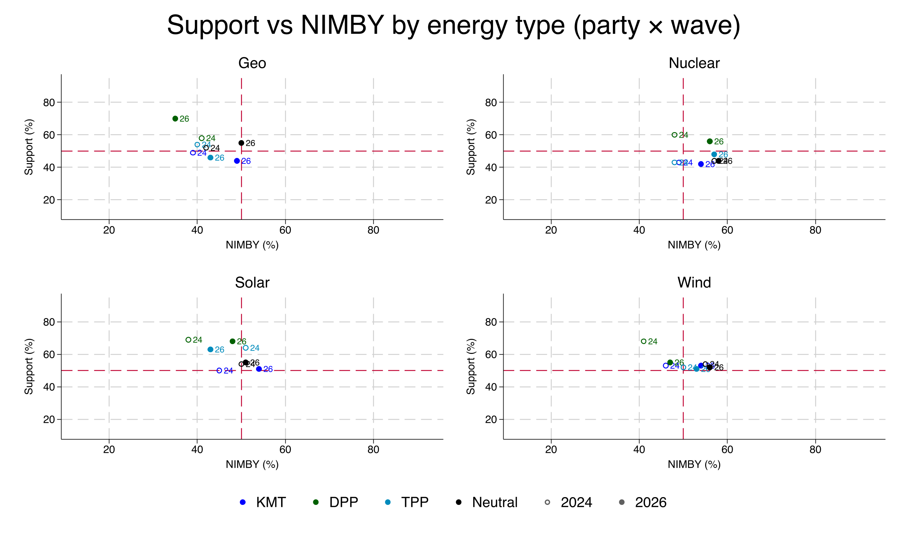
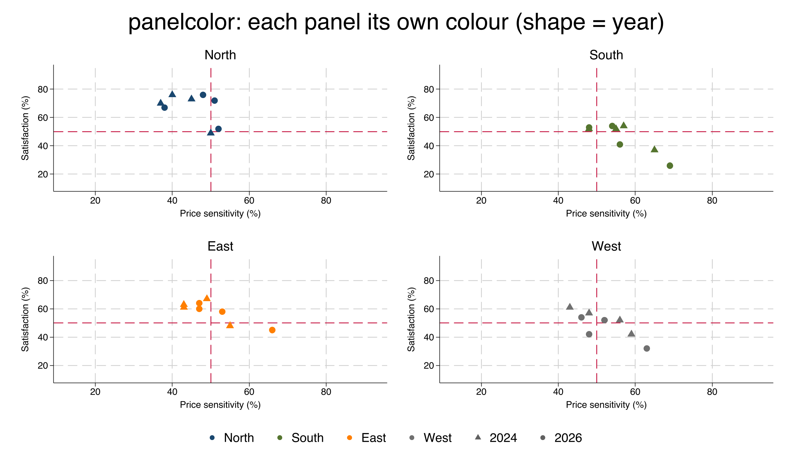

# quadrant

A Stata command that draws a **quadrant scatter plot**: points of *y* against
*x* with a central cross of reference lines splitting the plane into four
quadrants. Points can be coloured **by a group** (with a legend), **labelled**,
and one category drawn with a **hollow marker**. Ideal for support-vs-opposition,
importance-vs-performance, and similar two-dimensional positioning maps.


## Requirements

- Stata 16 or newer

## Installation

### Option A — `net install` (recommended)

```stata
net install quadrant, from("https://raw.githubusercontent.com/ganma0517/stata_quadrant/main/") replace
```

### Option B — `github install`

```stata
github install ganma0517/stata_quadrant
```

After installing, read the help and run the example:

```stata
help quadrant
do quadrant_example.do
```

## Quick start

A small **fictional** practice dataset is bundled (no real-world source):
`satisf` (Satisfaction %) vs `price` (Price sensitivity %) for four products
(`Alpha`–`Delta`) across four regions (`North`–`West`), in two waves (`year`
2024/2026).

```stata
use "https://raw.githubusercontent.com/ganma0517/stata_quadrant/main/quadrant_demo.dta", clear
quadrant satisf price if year==2024, by(region) mlabel(product) hollow("Delta")
```

## Three modes

```stata
* ungrouped (single colour)
quadrant satisf price if year==2024, mlabel(product) hollow("Delta")

* grouped (one colour per group + legend)
quadrant satisf price if year==2024, by(region) mlabel(product) hollow("Delta")

* grouped + pooled overall mean point set (black)
quadrant satisf price if year==2024, by(region) overall mlabel(product) hollow("Delta")
```

## Assigning a colour to each group — `bycolors()`

Map specific `by()` groups to specific colours with `value=colour` pairs. The key
can be the group's value label or its raw level value; any group you don't list
keeps the default palette colour:

```stata
quadrant satisf price if year==2024, by(region) mlabel(product) ///
    bycolors(North=navy South=forest_green East=orange West=gs7)
```

> `colors()` still works as a backward-compatible alias for `bycolors()`.


The same mapping is used consistently across faceted panels and in the shared legend.

## Assigning a marker shape to each group — `symbols()`

Map specific groups to specific marker symbols with `value=symbol` pairs (same
key rules as `bycolors()`). Stata symbols include `O`/`o` (large/small circle),
`D`/`d` (large/small diamond), `T`/`t` (triangle), `S`/`s` (square). The hollow
category automatically uses the matching outline symbol. Combine with `bycolors()`
for a legend that is coded by both colour and shape:

```stata
quadrant satisf price if year==2024, by(region) mlabel(product) ///
    symbols(North=O South=D East=S West=T) ///
    bycolors(North=navy South=forest_green East=orange West=gs7)
```


## Encoding a second grouping by shape — `bysymbol()`

Use `bysymbol(var2)` when you want **colour to mark one grouping (`by()`) and
marker shape to mark a second** — the classic case is comparing two survey waves.

> **Role split:** `by()` controls **colour**, `bysymbol()` controls **shape**.
> Put *different* variables in each. (If you put the same variable, e.g. the year,
> in both, colour and shape will both track it.) So for "colour by group, only the
> symbol differs by year": `by(group) bysymbol(year)`.
By default the first level is a **hollow circle** and the second a **solid
circle**; customise with `sbsymbols()` (a positional list, e.g. `sbsymbols(T O)`
for triangle then circle). The shared legend gains neutral grey keys for each
level, and it works in `panel()` mode too:

```stata
use quadrant_demo.dta, clear          // bundled demo has waves 2024 / 2026
quadrant satisf price, by(region) panel(product) bysymbol(year) msize(*2) ///
    range(10 95) sbsymbols(T O) ///
    bycolors(North=navy South=forest_green East=orange West=gs7)
```

> `symbolby()` still works as a backward-compatible alias for `bysymbol()`.
> A full runnable script is in `quadrant_bysymbol_example.do`.



### Colour follows the panel — `panelcolor`

To make **each panel entirely one colour** (e.g. one panel per party, every
point in that panel drawn in the party's colour, with only the *symbol*
differing by year), add the **`panelcolor`** option and map the year to shape
with `bysymbol()`:

```stata
quadrant satisf price, panel(region) panelcolor bysymbol(year) ///
    bycolors(North=navy South=forest_green East=orange West=gs7) sbsymbols(T O)
```

Here the North panel is all navy, South all green, etc.; within each panel the
2024 points are triangles and 2026 points are circles. (Equivalent to putting
the same variable in both `by()` and `panel()`.)



## Faceting with `panel()`

Draw one quadrant per level of another variable and combine them — ideal for
comparing the same positioning map across groups, items, time points, etc.
When the points are grouped with `by()`, the faceted figure gets a **single
shared legend** at the bottom (6 o'clock) instead of one legend per panel.

```stata
* one quadrant per region, points labelled by product
* (focus zooms each panel to its own data so points are easy to read)
quadrant satisf price if year==2024, panel(region) mlabel(product) meanlines focus

* faceted and grouped: one quadrant per product, coloured by region
quadrant satisf price if year==2024, panel(product) by(region) range(10 95)
```


## Syntax

```
quadrant yvar xvar [if] [in] [, options]
```

| Option | Description | Default |
|---|---|---|
| `by(varname)` | colour points by group + legend | — |
| `bycolors()` | explicit colour per `by()` group, e.g. `bycolors(North=navy South=forest_green)` (alias: `colors()`) | — |
| `bysymbol(varname)` | second grouping coded by marker shape (e.g. 2024 hollow, 2026 solid); alias `symbolby()` | — |
| `sbsymbols()` | symbol list for `bysymbol()` levels, e.g. `sbsymbols(Oh O)` | `Oh O …` |
| `overall` | also plot pooled mean points (black) | off |
| `mlabel(varname)` | point text labels | — |
| `hollow(string)` | label value drawn with a hollow marker | — |
| `xline(#)` `yline(#)` | reference cross position | 50 / 50 |
| `meanlines` | put the cross at the data means | off |
| `focus` | auto-zoom axes to the data (tidy ticks) | off |
| `panel(varname)` | facet: one quadrant per level, combined | — |
| `panelcolor` | colour each panel by its own panel value (pair with `bysymbol()`) | off |
| `cols(#)` | columns when faceting | auto |
| `range(# #)` | axis range (both axes) | 0 100 |
| `xrange(# #)` `yrange(# #)` | set each axis range separately | — |
| `palette()` | colours, one per group (positional) | — |
| `msize()` `msymbol()` | marker size / symbol (all groups) | medium / `O` |
| `symbols()` | explicit marker symbol per group, e.g. `symbols(North=O South=D East=S)` | — |
| `mlabsize()` | point-label size | small |
| `title()` `xtitle()` `ytitle()` | titles (accept sub-options, e.g. `size()`) | — |
| `aspect()` | aspect ratio (use `aspect(1)` for square) | off |
| `legend()` | `off`, or any twoway `legend()` sub-options, e.g. `legend(position(3) cols(1))` | bottom |
| `saving()` `name()` | export / window name | — |

See `help quadrant` for full documentation and examples.

## Files

- `quadrant.ado` — the command
- `quadrant.sthlp` — Stata help file
- `quadrant_example.do` — runnable tutorial
- `quadrant_means_example.do` — overall / group / both means
- `quadrant_bysymbol_example.do` — runnable `bysymbol()` (colour × shape) example
- `quadrant_demo.dta` — practice data (fictional): region × product × year (2024/2026)
- `example_*.png` — demo figures
- `quadrant.pkg`, `stata.toc` — package metadata for `net install`

## About the author

PhD in Political Science at National Chengchi University and a postdoctoral
research fellow at the Institute of Sociology, Academia Sinica. My research
focuses on political and social change in Taiwan and comparative politics, and I
use Claude to develop small Stata graphing tools that support empirical and
survey-experiment research. Questions welcome — beck740517@gmail.com

政治大學政治學系博士、中央研究院社會學研究所博士後研究員。研究聚焦台灣政治社會變遷與比較政治，
並使用 Claude 開發小型 Stata 製圖工具輔助實證與調查實驗研究。若有任何問題，歡迎寫信與我交流。

## Citation

Lin, Wen-Cheng (2026). *quadrant: Quadrant scatter plot with a central cross of
reference lines.* https://github.com/ganma0517/stata_quadrant

## License

MIT — see [LICENSE](LICENSE).
