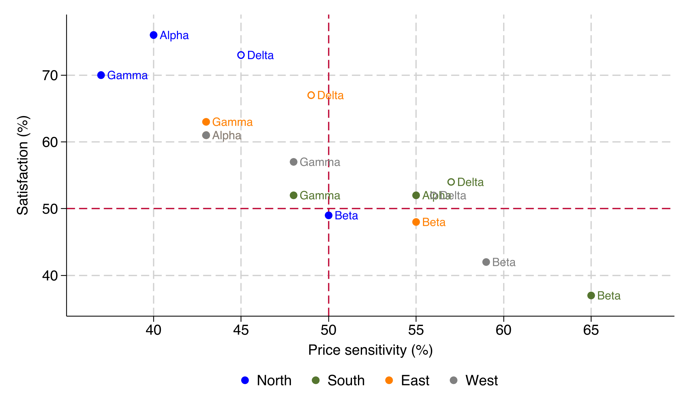
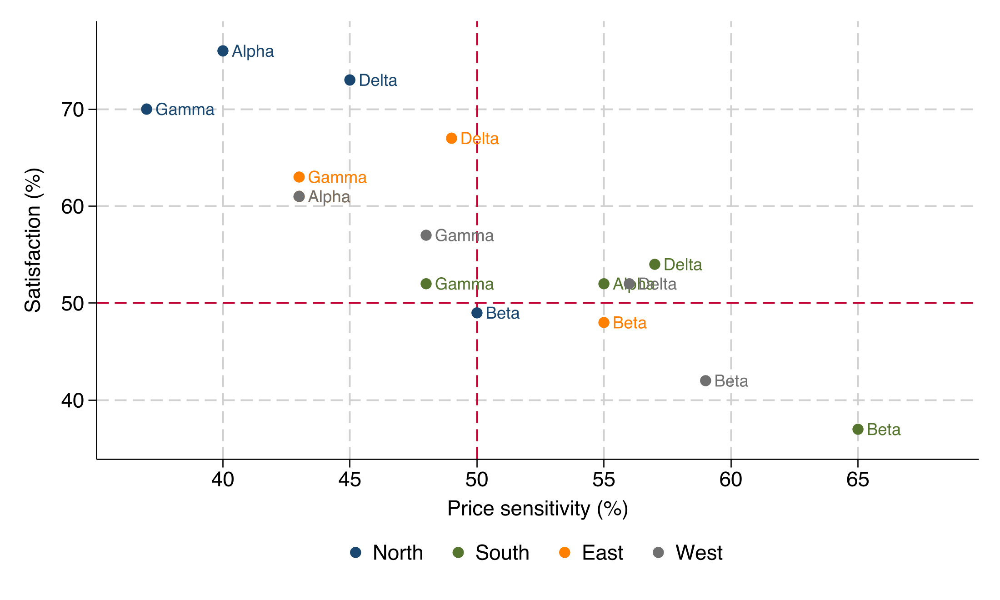
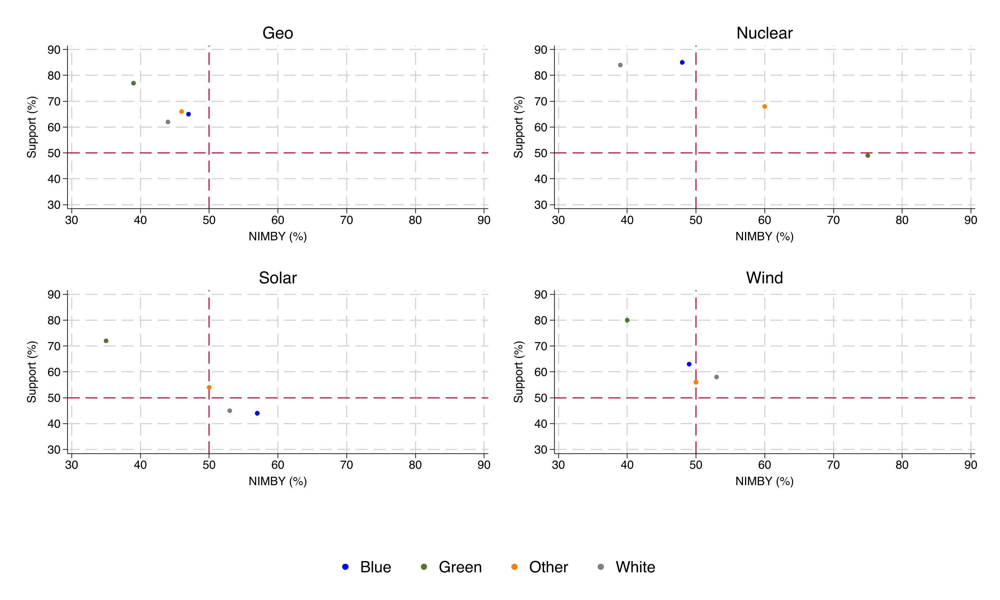

# quadrant

A Stata command that draws a **quadrant scatter plot**: points of *y* against
*x* with a central cross of reference lines splitting the plane into four
quadrants. Points can be coloured **by a group** (with a legend), **labelled**,
and one category drawn with a **hollow marker**. Ideal for support-vs-opposition,
importance-vs-performance, and similar two-dimensional positioning maps.



## Requirements

- Stata 16 or newer

## Installation

### Option A — `net install` (recommended)

```stata
net install quadrant, from("https://raw.githubusercontent.com/ganma0517/stata_quadrant/main/") replace
```

### Option B — `github install`

```stata
github install ganma0517/stata_quadrant
```

After installing, read the help and run the example:

```stata
help quadrant
do quadrant_example.do
```

## Quick start

A practice dataset is included — **fictional** support (%) vs NIMBY (%) for four
energy types across four party blocs (no real-world source):

```stata
use "https://raw.githubusercontent.com/ganma0517/stata_quadrant/main/quadrant_demo.dta", clear
quadrant support nimby, by(pid) mlabel(energy) hollow("Nuclear")
```

## Three modes

```stata
* ungrouped (single colour)
quadrant support nimby, mlabel(energy) hollow("Nuclear")

* grouped (one colour per group + legend)
quadrant support nimby, by(pid) mlabel(energy) hollow("Nuclear")

* grouped + pooled overall mean point set (black)
quadrant support nimby, by(pid) overall mlabel(energy) hollow("Nuclear")
```

## Assigning a colour to each group — `colors()`

Map specific groups to specific colours with `value=colour` pairs. The key can be
the group's value label or its raw level value; any group you don't list keeps the
default palette colour. Handy for party colours, e.g. KMT blue, DPP green, TPP grey,
neutral/no-response black:

```stata
quadrant support nimby, by(party) mlabel(issue) ///
    colors(KMT=blue DPP=green TPP=gs8 中立無反應=black)
```



The same mapping is used consistently across faceted panels and in the shared legend.

## Assigning a marker shape to each group — `symbols()`

Map specific groups to specific marker symbols with `value=symbol` pairs (same
key rules as `colors()`). Stata symbols include `O`/`o` (large/small circle),
`D`/`d` (large/small diamond), `T`/`t` (triangle), `S`/`s` (square). The hollow
category automatically uses the matching outline symbol. Combine with `colors()`
for a legend that is coded by both colour and shape:

```stata
quadrant support nimby, by(party) mlabel(issue) ///
    symbols(KMT=D DPP=d TPP=O 中立無反應=o) ///
    colors(KMT=blue DPP=green TPP=gs8 中立無反應=black)
```


## Faceting with `panel()`

Draw one quadrant per level of another variable and combine them — ideal for
comparing the same positioning map across blocs, sources, time points, etc.
When the points are grouped with `by()`, the faceted figure gets a **single
shared legend** at the bottom (6 o'clock) instead of one legend per panel.

```stata
* one quadrant per party, points labelled by energy source
* (focus zooms each panel to its own data so points are easy to read)
quadrant support nimby, panel(party) mlabel(energy) meanlines focus

* faceted and grouped: one quadrant per energy source, coloured by party
quadrant support nimby, panel(energy) by(party) range(30 90)
```



## Syntax

```
quadrant yvar xvar [if] [in] [, options]
```

| Option | Description | Default |
|---|---|---|
| `by(varname)` | colour points by group + legend | — |
| `colors()` | explicit colour per group, e.g. `colors(KMT=blue DPP=green TPP=gs8)` | — |
| `overall` | also plot pooled mean points (black) | off |
| `mlabel(varname)` | point text labels | — |
| `hollow(string)` | label value drawn with a hollow marker | — |
| `xline(#)` `yline(#)` | reference cross position | 50 / 50 |
| `meanlines` | put the cross at the data means | off |
| `focus` | auto-zoom axes to the data (tidy ticks) | off |
| `panel(varname)` | facet: one quadrant per level, combined | — |
| `cols(#)` | columns when faceting | auto |
| `range(# #)` | axis range (both axes) | 0 100 |
| `xrange(# #)` `yrange(# #)` | set each axis range separately | — |
| `palette()` | colours, one per group (positional) | — |
| `msize()` `msymbol()` | marker size / symbol (all groups) | medium / `O` |
| `symbols()` | explicit marker symbol per group, e.g. `symbols(KMT=D DPP=d TPP=O)` | — |
| `mlabsize()` | point-label size | small |
| `title()` `xtitle()` `ytitle()` | titles (accept sub-options, e.g. `size()`) | — |
| `aspect()` | aspect ratio (use `aspect(1)` for square) | off |
| `legend()` | `off`, or any twoway `legend()` sub-options, e.g. `legend(position(3) cols(1))` | bottom |
| `saving()` `name()` | export / window name | — |

See `help quadrant` for full documentation and examples.

## Files

- `quadrant.ado` — the command
- `quadrant.sthlp` — Stata help file
- `quadrant_example.do` — runnable tutorial
- `quadrant_demo.dta` — practice data (fictional, long format)
- `example_quadrant.png` — demo figure
- `quadrant.pkg`, `stata.toc` — package metadata for `net install`

## About the author

PhD in Political Science at National Chengchi University and a postdoctoral
research fellow at the Institute of Sociology, Academia Sinica. My research
focuses on political and social change in Taiwan and comparative politics, and I
use Claude to develop small Stata graphing tools that support empirical and
survey-experiment research. Questions welcome — beck740517@gmail.com

政治大學政治學系博士、中央研究院社會學研究所博士後研究員。研究聚焦台灣政治社會變遷與比較政治，
並使用 Claude 開發小型 Stata 製圖工具輔助實證與調查實驗研究。若有任何問題，歡迎寫信與我交流。

## Citation

Lin, Wen-Cheng (2026). *quadrant: Quadrant scatter plot with a central cross of
reference lines.* https://github.com/ganma0517/stata_quadrant

## License

MIT — see [LICENSE](LICENSE).
